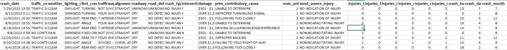
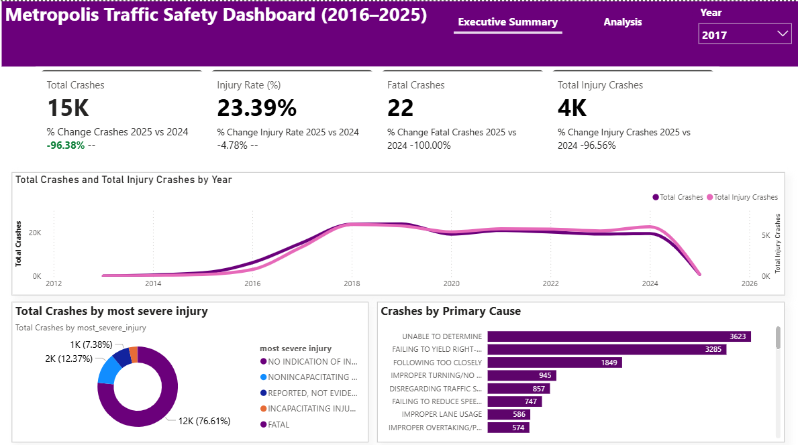

# Metropolis Traffic Safety Report (2016-205)

## Executive Summary
This report presents an in-depth analysis of traffic crash patterns in the City of Metropolis between January 1, 2016, and December 31, 2025. Commissioned by the Mayor, the study leverages a decade of crash data to uncover key trends, identify primary causes of severe accidents, and provide actionable insights to support safety initiatives, policy decisions, and budget allocations for the upcoming fiscal year.

## Business Context
Traffic safety is a major concern for Metropolis, with crashes causing injuries, fatalities, property damage, and economic losses. City leaders need clear, data-based insights to understand where and why crashes occur so they can allocate resources wisely, improve enforcement, and invest in safer infrastructure. This project provides those insights by turning raw crash data into a practical decision-making tool.

## Objectives

- Identify key trends in traffic crashes over the 10-year period (2016–2025).
- Analyze the main causes and crash types that lead to severe outcomes.
- Provide actionable insights to guide safety campaigns, police enforcement, and infrastructure investments.
- Demonstrate the use of Power BI for data cleaning, modeling, DAX, and visualization.

 ## Data Overview
The analysis is based on the dataset traffic_accidents.csv, which contains detailed records of traffic crashes in Metropolis from January 1, 2016, to December 31, 2025. Each record captures crash characteristics, environmental conditions, and resulting outcomes.

## Data Preview

## Key Findings

A total of 172,000 crashes were recorded in Metropolis between 2016 and 2025.
- The overall injury rate was 26.81%, with 46,000 crashes resulting in injuries.
- There were 299 fatal crashes during the period, highlighting the continued risk to public safety.
- Both crashes and injuries increased sharply from 2018 to 2024, before dropping to their lowest levels in 2025.
- The leading cause of crashes was recorded as “Undetermined”, followed by failure to yield right-of-way, indicating challenges in both driver behavior and crash reporting accuracy.
 ## Dashboard
 
 
 ## Link to power Bi Report
 Click the link to see the full report: [Click here](https://app.powerbi.com/view?r=eyJrIjoiMmY5ZGZlYmEtZDliNi00NjhmLTg5ZTEtNDk4NGFkZjg3MjBlIiwidCI6ImI1YTg0Nzk3LTlkM2YtNDFmMy05ZmQ3LWJiOGZlZWE2NmUzYSJ9)

 ## Data Cleaning and Transformation
- Verified date ranges to ensure all records fell between January 1, 2016, and December 31, 2025.
- Removed duplicate crash records to avoid double counting.
- Standardized text fields Like weather, lighting, and roadway conditions to correct spelling inconsistencies and unify categories.

## Detailed Findings & Analysis
 ### Key Performance Indicators (KPIs)
- The total number of reported crashes is 172,000.
- The number of crashes resulting in injuries 46,000.
- The percentage of crashes that resulted in injuries  is 26.81%.
- The total number of fatal crashes is 299.

### Crash Volume and Trends

Between 2016 and 2025, a total of 172,000 crashes were recorded in Metropolis. The trend analysis showed a relatively steady level of crashes until 2018, after which both crash counts and injury crashes rose significantly through 2024. In 2025, crashes and injuries dropped sharply to their lowest point across the entire 10-year period, suggesting that recent safety measures, enforcement strategies, or external factors had a strong positive impact.

### Injury and Fatality Outcomes

Out of all crashes, 46,000 resulted in injuries, representing an injury rate of 26.81%. Although most injuries were non-fatal, there were 299 fatal crashes during the study period. This highlights the continued need for targeted interventions focused on reducing high-severity crashes.

### Crash Causes

Analysis of contributory causes revealed that the leading cause of crashes was “Undetermined”, which may reflect incomplete reporting or data collection challenges. Among the identified causes, failure to yield right-of-way was the most significant, making it a priority area for driver education and traffic enforcement. Other notable causes included distracted driving and speeding, both of which contributed heavily to severe outcomes.

### Crash Characteristics

- Failure to Yield Right-of-Way: One of the most common crash characteristics, often leading to intersection-related collisions and contributing significantly to injury outcomes.
- Following Too Closely: Rear-end collisions were frequently linked to drivers not maintaining safe following distances, especially during peak traffic hours.
- Disregarding Traffic Signals: Ignoring stop signs or running red lights was a key factor in severe crashes, particularly at busy intersections.
- Improper Turning / No Signal: Unsafe or unindicated turns created conflicts with other vehicles and road users, leading to preventable crashes.

## Recommendations

- Focus on high-risk driving behaviors such as failure to yield, following too closely, disregarding traffic signals, and unsafe turning through awareness campaigns and stricter enforcement.
- Upgrade road infrastructure by improving intersections, signage, markings, and lighting to reduce crash risks.
- Standardize crash reporting to minimize “Undetermined” causes and improve data accuracy for decision-making.
- Implement seasonal safety campaigns, increase enforcement during peak hours and weekends, and monitor progress through Power BI dashboards.

## Tools Used
- **Power Query**: Data cleaning and transformation
- **Power BI**: Data analysis and visualization

## Conclusion
This analysis of traffic crashes in Metropolis from 2016 to 2025 highlights critical patterns that can guide safer roads and smarter resource allocation. With a total of 172,000 crashes, including 46,000 injury cases and 299 fatalities, the findings underscore the urgent need for targeted interventions. The sharp rise in crashes between 2018 and 2024, followed by a dramatic decline in 2025, suggests that focused safety measures can yield measurable results. However, challenges such as undetermined crash causes and persistent high-risk behaviors remain. By addressing behavioral factors, improving infrastructure, enhancing data quality, and adopting continuous monitoring, the city can strengthen public safety and make evidence-based decisions for future planning.

 

